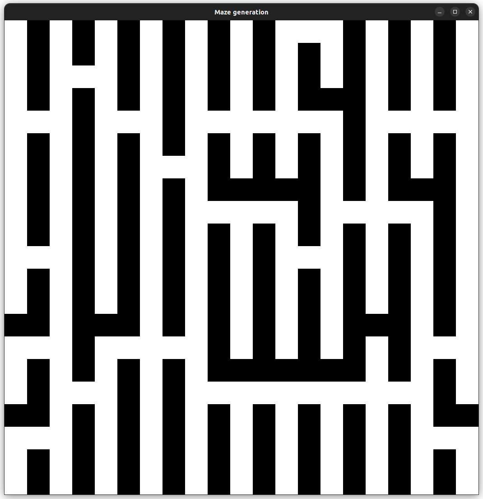

# Maze generation

This is a maze generation project, I have used the Randomized Prim's algorithm to generate a maze and displayed it using SFML.

## Resource:

[Wiki](https://en.wikipedia.org/wiki/Maze_generation_algorithm 'https://en.wikipedia.org/wiki/Maze_generation_algorithm')

## Goal:

- Animation
- More algorithms
- Dijkstra algorithm for solving
- Make code cleaner

## Example

